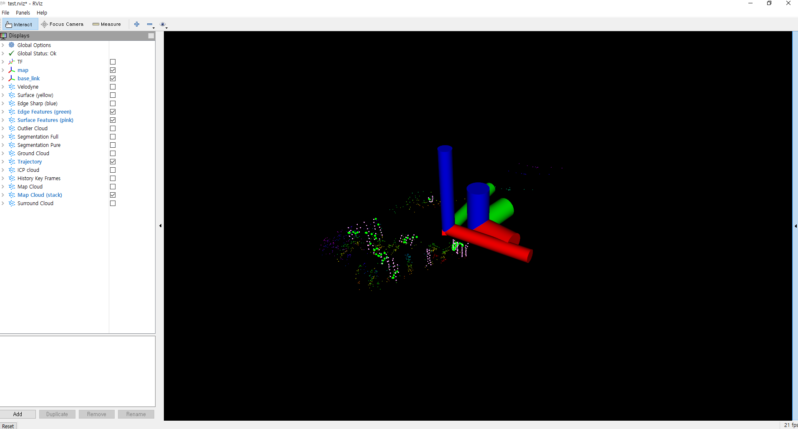

# 3D point cloud in Window 10 environment

* Velodyne publish in real-time using PCL::VLPGrabber
* Publish velodyne point cloud in ROS (melodic, window)


### 0. Download source code and build 
```bash
cd src && git clone --recursive https://github.com/haeyeoni/window_lego_loam
cd .. && catkin_make
```
### 1. Publish velodyne point cloud topic
```bash
roslaunch publish_velodyne test.launch
```

### 2. Run LeGO-LOAM 
```bash
roslaunch lego_loam run.launch
```

### Result
  


